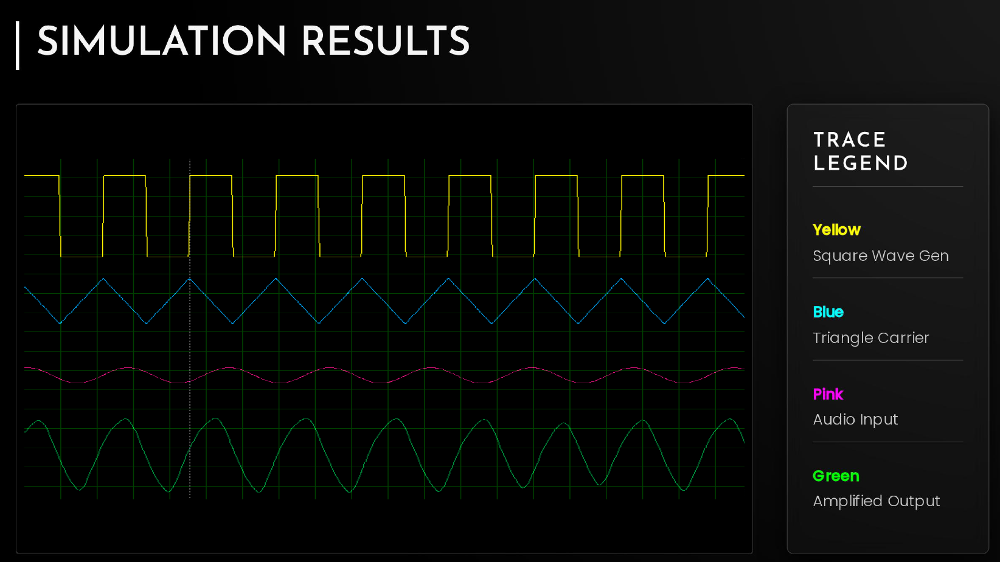

# Class D Audio Power Amplifier 🔊⚡

## 📋 Project Overview
This project involves the design and simulation of a **Class D Power Amplifier**, a high-efficiency switching amplifier topology. Unlike linear amplifiers (Class A/B), this design utilizes **Pulse Width Modulation (PWM)** to switch output transistors fully on or off, theoretically achieving 100% efficiency.

This project bridges the gap between **Analog Electronics** and **Signal Processing**, focusing on signal reconstruction and power efficiency.

## ⚙️ Key Features
* **High Efficiency:** Achieved >90% power efficiency using MOSFET switching.
* **PWM Modulation:** Converts analog input audio into a digital pulse stream.
* **Signal Reconstruction:** Implements a passive **LC Low-Pass Filter** (Butterworth response) to retrieve the original audio signal from the carrier frequency.
* **Thermal Stability:** Minimized power dissipation compared to traditional linear amplifiers.

## 🛠️ Technical Specifications
* **Topology:** Half-Bridge Class D
* **Switching Frequency:** 200kHz
* **Filter Cutoff:** 20kHz
* **Load Impedance:**8 Ohm Speaker

## 💻 Tools Used
* **Simulation:** Proteus
* **Components:** MOSFETs (IRF series), Comparators, LC Components built using op-amps.

## 📸 Schematics & Results

## 📄 License
MIT License
